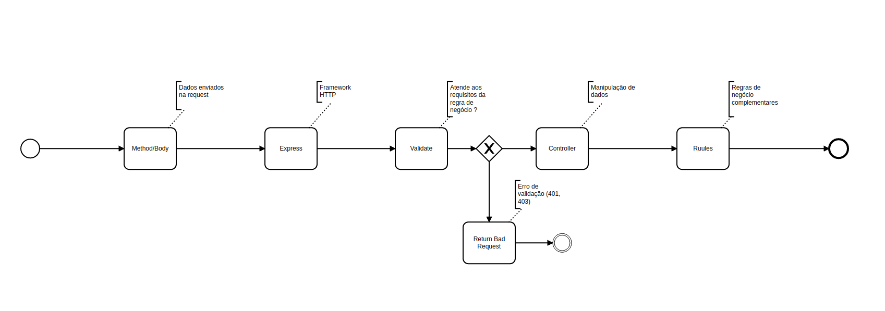
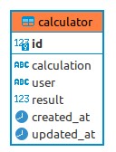

##Documentação

### Requisito de desenvolvimento
Requisitos obrigatórios para uso do framework:
- Node 14.15.1 [Node](https://nodejs.org)
- Mariadb 2.5.4 [Mariadb](https://www.mariadb.org)
- Yarn 1.22.10 [Yarn](https://yarnpkg.com/)
- Docker version 20.10.5 [Docker](https://https://www.docker.com/products/docker-desktop)
- Docker Compose 1.29.0  [Docker Compose](https://docs.docker.com/compose/install/)


### Instalação de dependências do projeto

Pré-requisitos:
- [x] Ter os executaveis para instalação dos [requisitos obrigatórios](#Requisito)
- [x] Abrir o diretório do projeto

Abrir o [terminal do seu sistema operacional] e executar o comando abaixo:

```shell
yarn install
```


### Configurações de ambiente

Pré-requisitos:
- [x] Ter instalado as dependências do projeto
- [x] Abrir o diretório do projeto

Criar um arquivo chamado ```.env```. Este arquivo deve conter as configurações das variáveis de ambiente do projeto

As variáveis do arquivo ````.env```` são:

```dotenv

# Database desenvolvimento
DATABASE_TYPE=""
DATABASE_HOST=""
DB_USERNAME=""
DB_PASSWORD=""
DATABASE_NAME=""

# PORT Service
PORT="3333"
```

### Database

Descrição das variavéis Database do arquivo ```.env```

| DB_USERNAME                |  DB_PASSWORD             |      DATABASE_NAME       |     DATABASE_HOST               |      DATABASE_TYPE                          |
| ---------------------------| ------------------------ | ------------------------ | ------------------------------- | ------------------------------------------- |
|  Usuário do banco de dados |  Senha do banco de dados | Nome do banco de dados   | Local ou IP do banco de dados   | Tipo de banco de dados selecionado para ORM |

O ORM usado para abstração do banco de dados é o [Sequelize](https://sequelize.org/)

Exemplo de valores para as variáveis:

```dotenv
## Database
DB_USERNAME="root"
DB_PASSWORD="calculatorroot"
DATABASE_NAME="calculator"
DATABASE_HOST="localhost"
DATABASE_TYPE="mariadb"
```

## Arquitetura do Framework

### Frameworks externos
Frameworks utilizados para disponibilização de serviço de API e Socket:

- Express [Express](https://expressjs.com/pt-br/)

### ORM/Plugins
ORM e plugins utilizados para abstração do banco de dados:

- Sequelize 6.3.5 [Sequelize](https://sequelize.org/)
- Sequelize-cli 6.2.0 [Sequelize-cli](https://yarnpkg.com/package/sequelize-cli)

Para criar o banco de dados, tabelas e dados necessários, executar comando abaixo:

```shell
yarn start:database
yarn migration:reload
```

#### Express
```Express.js é um framework para aplicações web para Node.js, lançado como software livre e de código aberto sob a licença MIT. É feito para otimizar a construção de aplicações web e API's. É um dos mais populares frameworks para servidores em Node.js.```

#### Middleware
````Funções de middleware são funções que tem acesso ao objeto de solicitação (req), o objeto de resposta (res), e a próxima função de middleware no ciclo solicitação-resposta do aplicativo. A próxima função middleware é comumente denotada por uma variável chamada next.````

#### Validate
```É um conjunto de middlewares Express.js que envolve as funções validator.js.```

#### Controller
```Os controladores são as funções de retorno de chamada que passamos aos router métodos.```


Segue abaixo o fluxo macro das camadas do Framework e suas funcionalidades:




## Iniciar Projeto

Existem 2 opções para iniciar o projeto:
- Script
- [Docker](https://www.docker.com/)

### Iniciar por script

Para iniciar o projeto por script de inicialização do ```package.json``` execute os seguintes comandos:

```shell
yarn start
```

### Iniciar por Docker

Para niciar a aplicação por docker a partir do ```docker-compose-database.yml´´´ execute os seguintes comandos (lembrando que é necessário apenas esta inicialização ou a anterior):

```shell
docker-compose -f docker-compose.yml -d --build
```

## Documentação da API Calculator_nodejs_test

### Apresentação

Endpoints referentes ao desafio técnico de backend em nodejs de uma calculadora que executa expressões matemáticas e armazena a expressão, resultados e usuário em banco de dados relacional.

### Autenticação

Não foi implementado métodos para autenticação nesta API, logo a mesma dispensa este tipo de metodologia.

## Requisições de usuário

## Execução de cálculo
### Tipo de método: POST

```shell
localhost:3333/calcs
```
Recebe um JSON como entrada contendo calculation (expressão matémática - recebe qualquer expressão incluindo as operações básicas, prioridade por parênteses e potência) e user (contendo o nome do usuário que realizará o cálculo) e retorna um objeto contendo a expressão, nome de usuário e resultado da expressão.

##BODY

```shell
{
"calculation" : "4+5*2*(5-3/2)",
"user" : "Junior"
}
```
## Listagem de cálculos realizados
### Tipo de método: GET

```shell
http://localhost:3333/calcs
```

Retorna todos os cálculos executados na calculadora (por ser uma aplicação simples, não fom implementado paginação).

## Listagem de cálculos realizados por usuário específico
### Tipo de método: GET

```shell
http://localhost:3333/calcs/junior
```

Retorna todos os cálculos executados na calculadora de um usuário específico com base no nome de usuário informado na requisição (por ser uma aplicação simples, não fom implementado paginação).

## Estrutura do banco de dados

Foi utilizado para esta aplicação o banco de dados relacional mariaDB. Por se tratar de um processo simples, o mesmo foi montado com apenas uma tabela:




### id

Coluna de chave primária para cada cálculo executado.

### calculation

Coluna que armazena as expressões de entrada da aplicação. Recebe uma string com toda a expressão.

### user

Coluna que armazena o nome do usuário em formato de string.

### result

Coluna que armazena o resultado da expressão enviada. Armazena dados do tipo real.

### created_at

Coluna que armazena a data de criação do dado em questão.

### updated_at

Coluna que armazena a data de modificação do dado em questão.
